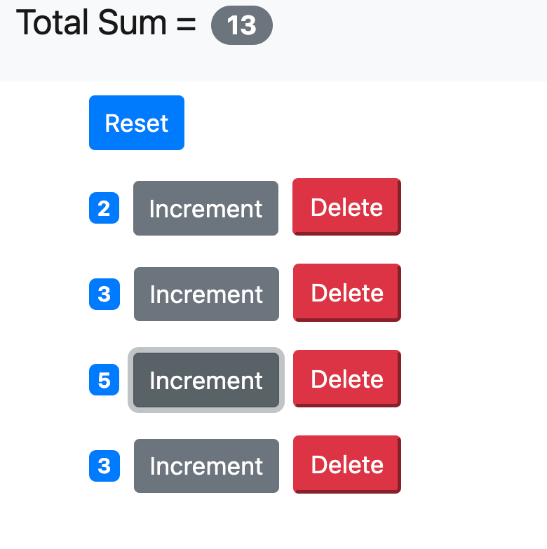

# Awesome React App

This is a pratice project to learn React JS.

## What I have learned

- How to write Hello World using React
- Components
- Specifying Children
- Embedding Expressions
- Setting Attributes
- Rendering Classes Dynamically
- Rendering Lists
- Conditional Rendering
- Handling Events
- Binding Event Handlers
- Updating States
- What Happens When State Changes
- Passing Event Arguments
- Composing Components
- Passing Data to Components
- Passing Children
- Debugging React Apps using react developer tools extention
- Props vs State
- Raising and Handling Events
- Single Source of Truth
- Removing the Local State
- Multiple Components in Sync
- Lifting the State Up
- Stateless Functional Components
- Destructuring Arguments
- Lifecycle Hooks
- Mounting Phase
- Updating Phase
- Unmounting Phase
- React Basics

## Demo

